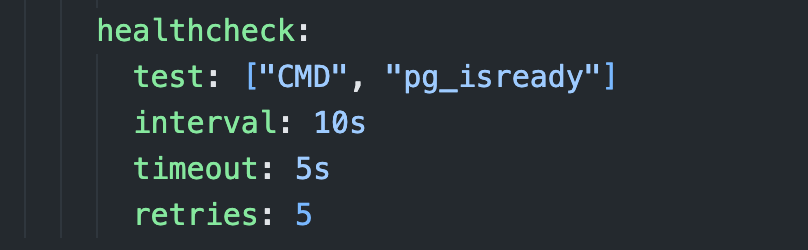

# [SRE Bootcamp](https://playbook.one2n.in/sre-bootcamp)

This repo contains the step by step implementation of **SRE Bootcamp** and updated **README** for the steps I followed to completed each milestone🏅

## Technologies used:

- OS: **Ubuntu 22.04 LTS**
- Web server: **Node.js, Expressjs**
- Unit Tests: **Jest,Supertest and Postman**
- Database: **PostgreSQL**
- Database Migration Tool: **Knex**
- Nodejs version: **v20.14.0 LTS**
- Containerisation: **Docker and Docker-Compose**
- CI: **Github Actions**
- Container Orchestration Tool: **Kubernetes**
- Load Balancer: **Nginx**
- External Secret Store: **AWS Secrets Manager**

## Milestones

1. [Create a simple REST API Webserver]
2. [Containerise REST API]
3. [Setup one-click local development setup]
4. [Setup a CI pipeline]
5. [Deploy REST API & its dependent services on bare metal]
6. [Setup Kubernetes cluster]
7. [Deploy REST API & its dependent services in K8s]
8. [Deploy REST API & its dependent services using Helm Charts]
9. [Setup one-click deployments using ArgoCD]
10. [Setup an observability stack]
11. [Configure dashboards & alerts]

---

[Pre-requisites]: #pre-requisites
[Create a simple REST API Webserver]: #create-a-simple-rest-api-webserver
[Containerise REST API]: #Containerise-REST-API
[Setup one-click local development setup]: #setup-one-click-local-development-setup
[Setup a CI pipeline]: #setup-a-CI-pipeline
[Deploy REST API & its dependent services on bare metal]: #deploy-rest-api--its-dependent-services-on-bare-metal
[Setup Kubernetes cluster]: #setup-kubernetes-cluster
[Deploy REST API & its dependent services in K8s]: #deploy-rest-api--its-dependent-services-in-K8s
[Deploy REST API & its dependent services using Helm Charts]: #deploy-rest-api--its-dependent-services-usin-helm-charts
[Setup one-click deployments using ArgoCD]: #setup-one-click-deployments-using-argoCD
[Setup an observability stack]: #setup-an-observability-stack
[Configure dashboards & alerts]: #configure-dashboards--alerts

### Pre-requisites:

- Once you have an Ubuntu system follow the below steps assuming you already have git CLI installed

```sh
sudo -i // switch to root user
apt update -y
```

- Clone the repo:

```sh
git clone https://github.com/rohit1101/SRE-Bootcamp-Web-Server.git
```

- Install the dependencies required for the project:

```sh
# installs nvm (Node Version Manager)
curl -o- https://raw.githubusercontent.com/nvm-sh/nvm/v0.39.7/install.sh | bash

# download and install Node.js
nvm install 20

# verifies the right Node.js version is in the environment
node -v # should print `v20.14.0`

# verifies the right NPM version is in the environment
npm -v # should print `10.7.0`
```

- Install postgresql:

```sh
apt install postgresql // this install psql client for interacting with the database with quries
```

- Switch to postgres user and use psql client
  

- Run the following command to set `postgres` user with a valid password and exit psql client using `\q` and type `exit` to logout from `postgres` user shell:

```psql
ALTER USER postgres PASSWORD 'postgres';
```

---

### 🏅Create a simple REST API Webserver

After successful pre-requisites setup following the below steps:

- Now let us clone this repo(fork and clone) and move into the src of the web server code:

```sh
git clone https://github.com/rohit1101/SRE-Bootcamp-Web-Server.git
cd SRE-Bootcamp-Web-Server
```

- Execute `make install` to install all the dependancies for the express js web server
- Run `make db_config` command creates a `knexfile.js` configuration file.
- Create a new directory named **migrations**

```sh
mkdir migrations
```

- Make sure you pass the correct values for the environment variables in a new file named `.env` by referring the `.env.example`. My `.env` file looks as shown below.\*Since I am testing the API locally I am using the default postgres DB for creating tables(on a production environment this is not recommended).

```env
NODE_ENV=development
DB_USER=postgres
DB_PASSWORD=postgres
DB_HOST=127.0.0.1
DB_PORT=5432
DB_DATABASE=postgres
```

- Modify the `knexfile.js` configuration file based on your requirements

```js
require("dotenv").config({ path: ".env" });
module.exports = {
  development: {
    client: "pg",
    connection: {
      user: process.env.DB_USER,
      host: process.env.DB_HOST,
      database: process.env.DB_DATABASE,
      password: process.env.DB_PASSWORD,
    },
    pool: {
      min: 2,
      max: 10,
    },
    migrations: {
      directory: "./migrations",
    },
  },
};
```

- Create a new migration, the following command will create a new migrations file in this path -> `migrations/` and update the migrations file by refering the migrations file in this repo.

```sh
make create_migrations
```

- This command applies the migration and creates the students table in your PostgreSQL database.

```sh
make migrate
```

  
  
  
- Now switch to `postgres` user and enter `psql` to check our `students` table:
  

### Endpoints

> Base URL
> `http://locahost/v1`

### Health Check

#### GET /v1/healthcheck

- **Description:** Checks API health status.
- **Response:** `200 OK`

**Example Request:**

```sh
curl -X GET http://localhost/v1/healthcheck
```

### Get All Students

#### GET /v1/students

- **Description:** Retrieves all students.
- **Response:** `200 OK`

**Example Request:**

```sh
curl -X GET http://localhost/v1/students
```

### Get Student by ID

#### GET /v1/students/{id}

- **Description:** Retrieves student by ID.
- **Response:** `200 OK` / `404 Not Found`

**Example Request:**

```sh
curl -X GET http://your-api-domain.com/v1/students/1
```

### Create New Student

#### POST /v1/students

- **Description:** Creates a new student.
- **Response:** `200 Created` / `400 Bad Request`
- **Request body:**
  - name: `string`
  - age: `number`
  - department: `string`

**Example Request:**

```sh
curl -X POST http://localhost/v1/students \
  -H "Content-Type: application/json" \
  -d '{"name": "Alice", "age": 23, "department": "MECH"}'
```

### Delete Student by ID

#### DELETE /v1/students/{id}

- **Description:** Deletes student by ID.
- **Response:** `200 No Content` / `404 Not Found`

**Example Request:**

```sh
curl -X DELETE http://localhost/v1/students/4
```

### Update Existing Student

#### PUT /v1/students/{id}

- **Description:** Updates student by ID.
- **Response:** `200 OK` / `400 Bad Request` / `404 Not Found`
- **Request body:**
  - name: `string`
  - age: `number`
  - department: `string`

**Example Request:**

```sh
curl -X PUT http://localhost/v1/students/5 \
  -H "Content-Type: application/json" \
  -d '{"name": "Robert", "age": 24, "department": "ECE"}'
```

---

### 🏅Containerise REST API

Follow the instructions to install docker on your Ubuntu Machine -> [Install docker on ubuntu](https://docs.docker.com/engine/install/ubuntu/#install-using-the-repository)

- Create a Dockerfile for running the web server using `node-*-apline` image for reducing the image size

```Dockerfile
ARG NODE_VERSION=20.14.0

FROM node:${NODE_VERSION}-alpine AS build

# Set working directory as /app
WORKDIR /app

# copy deps
COPY ./package*.json ./

# install the dependencies
RUN npm install

# copy all source code
COPY . .

FROM build as run

WORKDIR /app
COPY --from=build /app ./

# set envs required for the web-server to run
ARG NODE_ENV=development
ARG DB_USER=postgres
ARG DB_PASSWORD=postgres
ARG DB_HOST=127.0.0.1
ARG DB_PORT=5432
ARG DB_DATABASE=postgres

# expose port 3000 for the web server to be accessed
EXPOSE 3000

# execute this following command once the container boots
ENTRYPOINT ["npm","start"]
```

- Command for building a Docker Image and pushing it to Docker Hub (This step requires you to have a Docker Hub account):

```sh
# Create an image
docker build -t <docker-hub-repo-name>/<image-name>:<tag-name>v1.0
```

- Login using Docker Hub credentials:
  
- Command for pushing the image to your Docker Hub account:

```sh
docker push <docker-hub-repo-name>/<image-name>:<tag-name>v1.0
```

- To execute `make containerise` to pull the image from docker registry and create a `web-server` container make sure your provide your Docker Hub repo name and image with the desired tag.
- **NOTE: In the above Dockerfile I have directly passed a environment variables but in production environment it is better to use Docker secrets.**

---

### 🏅Setup one-click local development setup

Now let's make the local developement setup quicker by using `docker-compose` and trigger server and DB containers using a single `make` command

- First let us update the `.env` file with appropriate values since when we create containers using `docker-compose`

  ```sh
  NODE_ENV=development
  DB_USER=postgres
  DB_PASSWORD=postgres
  DB_HOST=db
  DB_PORT=5432
  DB_DATABASE=postgres
  ```

- Please refer the `compose.yaml` for creating DB container first and checking the health of postgresql DB which then triggers migrations and starts the web-server.

  - Server depends on DB service:
    

  - Health Check on DB:
    

- The following is the updated Dockerfile for applying migrations and starting the web server

  ```Dockerfile
  ENTRYPOINT ["sh", "-c", "npx knex migrate:latest && npm start"]
  ```

- Run `make start_app` for starting the app (web-server + db)
- Make a the following `curl` request and open `http://localhost:3000/v1/students` to view all students as response

```sh
curl -X POST http://localhost:3000/v1/students \
  -H "Content-Type: application/json" \
  -d '{"name": "Alice", "age": 23, "department": "Arts"}'
```

---

### 🏅Setup a CI pipeline

- For setting up self-hosted Github Actions Runner we need to navigate to the **Settings** tab from the repository.
  
- Then click on Actions dropdown and click on Runners.
  
- Click on **New self-hosted runner** button
  
- Follow the instructions on this page and setup a self-hosted runner and make sure to set `runs-on: self-hosted`
  
- Finally let us start our self-hosted runner to run workflows on our system:
  ```sh
    cd actions-runner/
    ./run.sh
  ```
- To setup github actions follow the below command from the root of the project folder and write your github action config on a `.yaml` file
  ```sh
    mkdir -p .github/workflows/
    cd .github/workflows/
    touch <github-action-filename>.yaml
  ```

---

### 🏅Deploy REST API & its dependent services on bare metal

For this Milestone, I am using VirtuaBox for using Vagrant for Virtualisation
Install VirtualBox on a desired OS -> [Install VirtualBox](https://www.virtualbox.org/wiki/Downloads)

Steps for installing Vagrant on a desired OS -> [Install Vagrant](https://developer.hashicorp.com/vagrant/install)

- First let us setup the following architecture using docker-compose on host machine and test it.


- nginx as load balancer by exposing `8080:80`
- ws-1 (web server 1) by exposing `8081:3000`
- ws-2 (web server 2) by exposing `8082:3000`
- db (postgres db) by exposing `5432`

- Assuming the previous step is working as expected now let us create a directory and initialise Vagrant:
  ```sh
  mkdir <directory-name> && cd <directory-name>
  vagrant init hashicorp/bionic64 # creates Vagrantfile
  ```
- Start VM using:
  ```sh
  vagrant up
  ```
- Use `logout` to exit the box
- Create a `script.sh` file and add the installation commands for dependancies, this `script.sh` on host machine will be synced on the VM in `/vagrant/`
- Let us modify `Vagrantfile` to install the dependancies using a shell script while provisioning
  ```sh
    config.vm.provision "shell", inline: "/bin/bash /vagrant/script.sh",
      run: "once"
  ```
- Run the following command for provisioning the VM with the shell script:
  ```sh
  vagrant provision --provision-with shell
  ```
- Finally let us config the port forwarding on `Vagrantfile` such that when we access `http://localhost:8080/v1/healthcheck` from `host` machine the traffic is forwarded to `guest` machine port `8080`
  ```sh
    config.vm.network "forwarded_port", guest: 8080, host: 8080
  ```
- Now `logout` from `guest` machine and run `vagrant reload` to run our VM with the updated port forwarding setup.
- Now let us test the port forwarding:
  ```sh
  cd SRE-Bootcamp-Web-Server/
  sudo docker compose --profile DB up --build -d
  ```
- Open your browser and test `http://localhost:8080/v1/healthcheck`

---

### 🏅Setup Kubernetes cluster

- Follow this [link](https://minikube.sigs.k8s.io/docs/start/?arch=%2Flinux%2Fx86-64%2Fstable%2Fbinary+download) to install `minikube` on the required OS.
- Follow this [link](https://kubernetes.io/docs/tasks/tools/) to install `kubectl` cli tool for your OS.

**NOTE: Make sure docker daemon is running in background before proceeding**

- Execute `minikube start --nodes 4 -p multinode-setup` to setup multi-node cluster.
- Run the following command to set label for our nodes:
  ```sh
  kubectl label node multinode-setup-m02 type=app
  kubectl label node multinode-setup-m03 type=db
  kubectl label node multinode-setup-m04 type=deps
  ```

---

### 🏅Deploy REST API & its dependent services in K8s

First let us create a multinode cluster using minikube for deploying our REST APIs and the dependencies on K8s.

- Use this command to create multi-node setup with minikube:

```sh
minikube start -n=4 -p multinode-setup
```

- Create a namespace with `kubectl` command below:

```sh
kubectl create ns student-api-ns
```

- Switch to our namespace:

```sh
kubectl config set-context --current --namespace=student-api-ns
```

- Make sure you add your service, deployment, config maps and secrets in a single yaml file within a folder (like /app/app.yaml and /db/db.yaml)
- Go to the appropriate directory and execute which will create required object in our K8s cluster.

```sh
kubectl create -f k8s/manifest/<folder-name>/<manifest-filename>.yaml
```

- Use the following command to test the web server and db connection locally by port forwarding, here `30002` is the `nodePort` for the `ws-service` and `8000` is the exposed port from the pod

```sh
kubectl port-forward service/ws-service 30002:8000
```

- Till now we have used configMaps for passing environment variables to the respective pods, which is not the good way of doing thing in production, hence the following steps will guide you to setup external secret store and we will use AWS Secrets Manager for storing the secrets.
- Let us create a namespace for external secret store and switch the context

```sh
kubectl create ns eso-ns
kubectl config set-context --current --namespace=eso-ns
```

---

### 🏅Deploy REST API & its dependent services using Helm Charts

🚧 Work in progress

---

### 🏅Setup one-click deployments using ArgoCD

🚧 Work in progress

---

### 🏅Setup an observability stack

🚧 Work in progress

---

### 🏅Configure dashboards & alerts

🚧 Work in progress

---

### The **Whys** of few steps or commands ?

- [Why `apt update -y` on Debian-based distros ?](https://askubuntu.com/a/222352)
- [Why am i using AWS Secrets Manager instead of Hashicorp Vault ?](https://github.com/hashicorp/vault/issues/15197)
